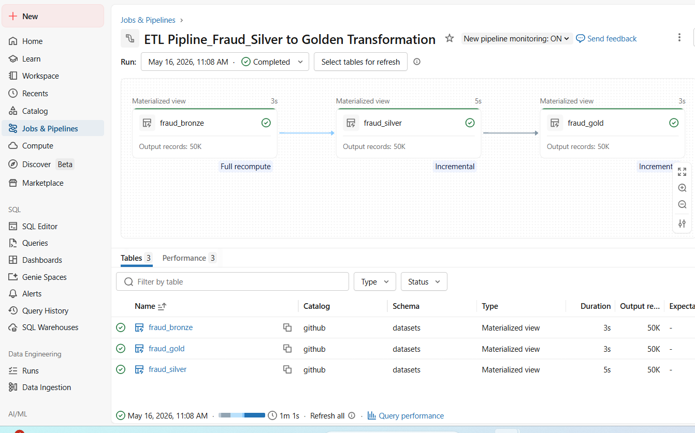
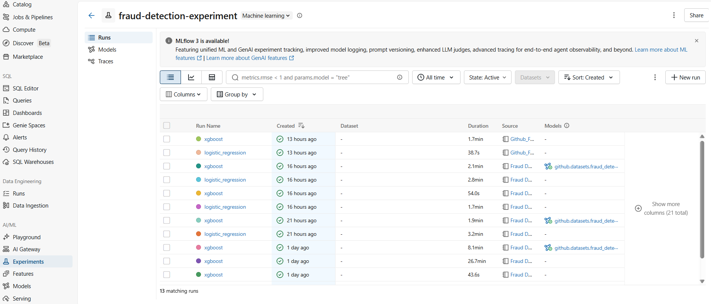

# 📊 Machine Learning-Based End-to-End Fraud Detection System
## 🧾 Project Overview

This project builds a complete end-to-end fraud detection system combining data engineering, analytics, and machine learning. It follows a production-style workflow using Databricks Medallion Architecture, MLflow, and Power BI.

The system is designed to:
- Detect fraudulent transactions in large-scale data
- Monitor fraud risk patterns in real time
- Support data-driven business decisions

## 📁 Dataset & Source
-	Source: Fraud Detection Transactions Dataset (https://www.kaggle.com/datasets/samayashar/fraud-detection-transactions-dataset/data)
-	Time Period: January 2023 – December 2023 
-	Purpose: Used for learning and portfolio purpose
## 📁 Project Workflow
  The project follows a three-stage pipeline architecture

### ETL Pipeline (Databricks Medallion Architecture)
- Bronze: Raw data ingestion and storage for traceability
- Silver: Data cleaning, missing value handling, and validation
- Gold: Final curated dataset 
- Automation: Scheduled workflows ensure fresh and reliable data
  

### MLflow (Machine Learning Pipeline)
#### Models Used
- Logistic Regression (baseline model)
- XGBoost (advanced model)
#### Workflow
- Workflow: Data loading → EDA → Feature engineering → Training → Evaluation → Model registration → Deployment
#### Validation Results
- Logistic Regression → F1: 0.7157 | AUC: 0.8962
- XGBoost → F1: 0.9994 | AUC: 1.0000

[View MLflow Notebook](ML_Pipeline_MLflow/mlflow_fraud_detection.ipynb)

### 🔹 Automated Fraud Detection Dashboard
#### Purpose
- Real-time fraud monitoring
- Risk tracking and visualization
- Business decision support
- Features
- Interactive filters
- Time-based analysis
- Risk segmentation dashboards
## 💼 Business Questions
- How significant is fraud in the system?
- What is the nature of fraud behavior?
- Which channels are most affected by fraud?
- Does user behavior influence fraud occurrence?
- When does fraud activity peak?
- Are authentication methods effective?
- Can high-risk users be identified?

## 📊 Interpretation of KPIs & Plots
### 🔹 Fraud Impact Overview
- Fraud Rate: 32.13%
- Fraud Transactions: 16.07K / 50K (~32%)
- Fraud Loss: 1.5M / 5.0M (~30%)
  
👉 Fraud represents a large portion of both transaction count and financial value, indicating a significant operational risk.

### 🔹 Fraud Behavior Pattern
- Average Fraud Amount: ~99.68
- Transaction Range: 10K–17K (~70% variation)
  
👉 Fraud is dominated by low-value, high-frequency transactions, blending into normal activity patterns.

### 🔹 Channel Distribution
- Card Types: ~25% each
- Device Types: ~33% each
- Transaction Types: ~25% each

👉 Fraud is evenly distributed across all channels, showing no single dominant fraud source.

### 🔹 Time-Based Pattern
- Weekday Fraud: 70.03%
- Weekend Fraud: 28.97%
- Daily trend: 35–58 transactions (peaks >60)

👉 Fraud is significantly higher on weekdays with occasional spikes in activity.

### 🔹 Risk & Network Signals
- Suspicious IPs: ~85% of fraud cases
- Risk Score Average: 0.502

👉 Fraud is strongly associated with specific network sources, while risk distribution remains balanced.

### 🔹 User Behavior Insights
- Prior Fraud Users: 51% vs 49%
- Fraud clusters found in high-frequency user segments

👉 User behavior shows slight influence on fraud likelihood, especially in repeated activity patterns.

### 🔹 Authentication Analysis
- Biometric / OTP / Password / PIN: ~25% each

👉 Fraud is uniform across all authentication methods, indicating equal exposure across security types.

## 📈 Business Answers
- Fraud is highly significant, impacting both transaction volume and financial value
- Fraud follows a low-value, high-frequency pattern
- Fraud is multi-channel and evenly distributed across systems
- User behavior shows mild influence through history and activity patterns
- Fraud is higher during weekdays with occasional spikes
- Authentication methods do not significantly differentiate fraud patterns
- High-risk users can be identified through behavioral segmentation
## 🧠 Recommendations
- Deploy XGBoost model as primary fraud detection system
- Improve feature engineering using behavioral patterns (frequency, history, deviation)
- Implement dynamic risk thresholds for better risk classification
- Focus monitoring on weekday spikes and anomaly periods
- Strengthen IP-based risk identification
- Apply user segmentation for targeted fraud monitoring
- Enhance detection using multi-layer behavioral analysis
## 🛠️ Tools & Technologies
- Databricks (ETL pipelines, Medallion architecture)
- Apache Spark (data processing)
- Python (data analysis & machine learning)
- MLflow (experiment tracking & model management)
- Power BI (dashboard & visualization)
## ✅ Final Outcome
This project delivers a complete end-to-end fraud detection system integrating:
- Scalable data engineering
- Machine learning models
- Business intelligence dashboards
- Actionable fraud insights

